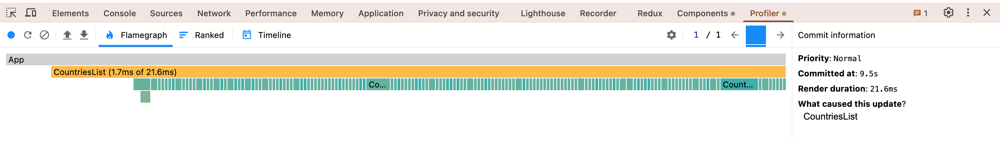
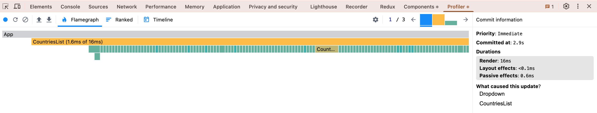

# React Performance

## Performance Profiling

1. **Initial Profiling with React Dev Tools Profiler**

- **Parameters to Check:**
  - **Commit Duration:** Time taken for React to render the committed updates.
  - **Render Duration:** Time taken for individual components to render.
  - **Interactions:** User interactions that triggered the renders.
  - **Flame Graph:** Visual representation of component render times.
  - **Ranked Chart:** Sorted list of components by render duration.

**Sorting by Population**

- **Commit Duration:** 9.5s
- **Render Duration:** 21.6ms
- **Interactions:** Click on Sorting by Population.
- **Flame Graph:** [Flame Graph](profiling/init_profiling_sorting_population_flamegraph.png).
- **Ranked Chart:** [Ranked Chart](profiling/init_profiling%20sorting_population_ranked.png).

**Filtering**

- **Commit Duration:** 2.9s
- **Render Duration:** 16ms
- **Interactions:** Click on Filtering.
- **Flame Graph:** [Flame Graph](profiling/init_filtering_flamed.png).
- **Ranked Chart:** [Ranked Chart](profiling/init_filtering_ranked.png).

1. **Update the App with React.memo and useMemo**

- **Parameters to Check:**
  - **Commit Duration:** Compare the time taken for React to render the committed updates before and after optimization.
  - **Render Duration:** Compare the time taken for individual components to render before and after optimization.
  - **Interactions:** Analyze if the number of interactions triggering renders has decreased.
  - **Flame Graph:** Compare the visual representation of component render times before and after optimization.
  - **Ranked Chart:** Compare the sorted list of components by render duration before and after optimization.
